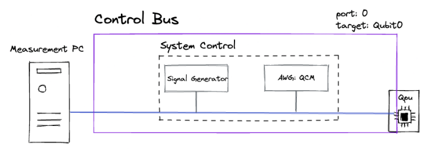
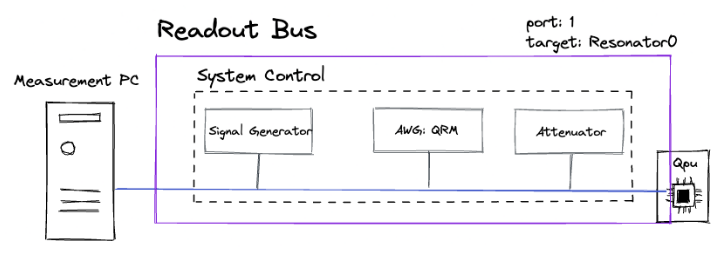

Buses
+++++++++++++++++++++++++
Describes **a line** with all required equipment necessary to communicate from the measurement **PC to a target** (Qubit, Resonator or Coupler) **via a chip port**.

Each specific Bus type has only one specific **System Control** type

Time Domain
**************
This type of buses uses pulses uploaded to an **AWG** to run an experiment. There are the following types:

Baseband Bus
---------------
The system control contains an **AWG** and a **Current Source**

Control Bus
---------
The system control contains an **AWG** and a **Signal Generator**
|

|

Readout Bus
---------
The system control contains an **AWG**, a **Signal Generator** and an **ADC**
|

|

Continous
***********
No pulses required, just the system control is turned on and setup with the desired parameters.

Current bias Bus
--------------------
The system control contains a **Current Source**

Microwave bias Bus
-----------------------
The system control contains a **Signal generator**

Readout Bus
---------------
The system control contains a **VNA**

Simulated
*****************
