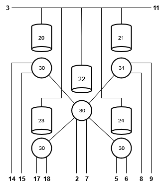

Chip 
+++++++++++
On this part of the runcard, we determinate the architecture of our chip and how it is connected to the different ports.
So, via text, we describe the different elements of our chip and how are they connected.

Simple example
----------------
Here is a very simple example of a chip explained in the runcard format:

::

      chip:
        id_: 0
        category: chip
        alias: "advanced"
        nodes:
        - name: port
            id_: 0
            nodes: [3]
        - name: port
            id_: 1
            nodes: [2]
        - name: resonator
            alias: resonator
            id_: 2
            frequency: 8.0726e+09
            nodes: [1, 3]
        - name: qubit
            alias: qubit
            id_: 3
            qubit_index: 0
            frequency: 6.5328e+09
            nodes: [0, 2]

Which is represented in the next diagram:

In this example, we have a qubit, a resonator, and the two ports from where we manipulate them.
As you can recall every component has an id from which we refer to. Nodes indicate what is connected to what, for example, in our simple case, ``id_ : 2``which is a resonator is connected to ``nodes : [1, 3]``.
That means that our resonator is connected to the port ``id_ : 1`` and the qubit ``id_ : 3``.

Advanced example
--------------------

.. raw:: html
    
   

    

            

                <pre>
                    
    chip:
        id_: 0
        category: chip
        alias: "advanced"
        nodes:
        - name: port
            id_: 1
            nodes: []
        - name: port
            id_: 2
            alias: drive_line_q2
            nodes: [32]
        - name: port
            id_: 3
            alias: feedline_input
            nodes: [24, 23, 20, 22, 21]
        - name: port
            id_: 4
            nodes: []
        - name: port
            id_: 5
            alias: flux_bias_line_q4
            nodes: [34]
        - name: port
            id_: 6
            alias: drive_line_q4
            nodes: [34]
        - name: port
            id_: 7
            alias: flux_bias_line_q2
            nodes: [32]
        - name: port
            id_: 8
            alias: drive_line_q1
            nodes: [31]
        - name: port
            id_: 9
            alias: flux_bias_line_q1
            nodes: [31]
        - name: port
            id_: 10
            nodes: []
        - name: port
            id_: 11
            alias: feedline_output
            nodes: [21, 22, 20, 23, 24]
        - name: port
            id_: 12
            nodes: []
        - name: port
            id_: 13
            nodes: []
        - name: port
            id_: 14
            alias: flux_bias_line_q0
            nodes: [30]
        - name: port
            id_: 15
            alias: drive_line_q0
            nodes: [30]
        - name: port
            id_: 16
            nodes: []
        - name: port
            id_: 17
            alias: drive_line_q3
            nodes: [33]
        - name: port
            id_: 18
            alias: flux_bias_line_q3
            nodes: [33]

        - name: resonator
            alias: resonator_q0
            id_: 20
            frequency: 7.4e+09
            nodes: [30, 3, 11]
        - name: resonator
            alias: resonator_q1
            id_: 21
            frequency: 7.6e+09
            nodes: [31, 3, 11]
        - name: resonator
            alias: resonator_q2
            id_: 22
            frequency: 7.8e+09
            nodes: [32, 3, 11]
        - name: resonator
            alias: resonator_q3
            id_: 23
            frequency: 8.0e+09
            nodes: [33, 3, 11]
        - name: resonator
            alias: resonator_q4
            id_: 24
            frequency: 8.2e+09
            nodes: [34, 3, 11]

        - name: qubit
            alias: qubit_0
            id_: 30
            qubit_index: 0
            frequency: 4.658e+09
            nodes: [14, 15, 20, 32]
        - name: qubit
            alias: qubit_1
            id_: 31
            qubit_index: 1
            frequency: 4.728e+09
            nodes: [8, 9, 21, 32]
        - name: qubit
            alias: qubit_2
            id_: 32
            qubit_index: 2
            frequency: 5.269e+09
            nodes: [2, 7, 22, 30, 31, 33, 34]
        - name: qubit
            alias: qubit_3
            id_: 33
            qubit_index: 3
            frequency: 6.264e+09
            nodes: [17, 18, 20, 32]
        - name: qubit
            alias: qubit_4
            id_: 34
            qubit_index: 4
            frequency: 6.208e+09
            nodes: [5, 6, 24, 32]
                    
                </pre>
            

        

       
   

Parts
--------------
Aqui anirien mes parts tecniques, nose si fa falta.