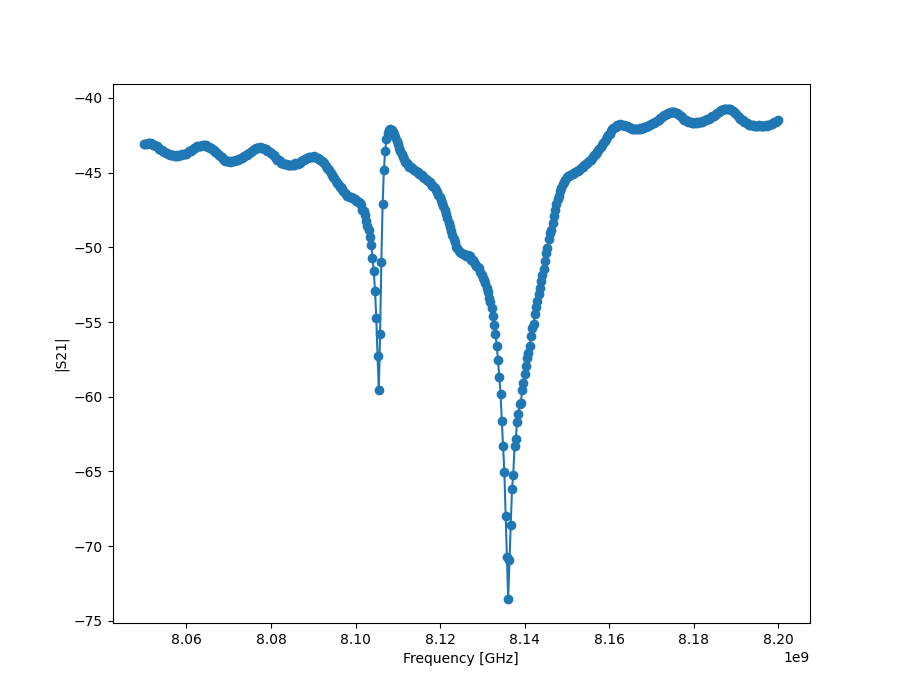

Resonator spectroscopy
=======================

A ressonator spectroscopy is the first procedure in order to calibrate out quantum computer.
This procedure is meant to find the resonant frequency of the different resonators.To do that, we make a sweep of frequencies in a reasonable rang to find the one that resonates in our particular resonator. These procedure is done while our qubit is in the ground state.

Firs of all let us import all the libraries needed.

::

    """Run circuit experiment"""
    import numpy as np
    import matplotlib.pyplot as plt

    import os

    from qibo.models.circuit import Circuit
    from qibo.gates import M

    from qiboconnection.api import API
    from qiboconnection.connection import ConnectionConfiguration
    from qiboconnection.connection import Connection

    from qililab import build_platform
    from qililab.experiment import Experiment
    from qililab.typings import Parameter, ExperimentOptions, ExperimentSettings
    from qililab.utils import Loop
    from qililab.typings.loop import LoopOptions
    from qililab.typings.execution import ExecutionOptions
    from qililab.config import logger

    logger.setLevel(30)

    os.environ["RUNCARDS"] = "./runcards"
    os.environ["DATA"] = "/home/qilimanjaro/Documents/data"

    %matplotlib widget

Qibo connection setup
----------------------------

In order to connect to the quantum computer, lets set our connection

::

    configuration=ConnectionConfiguration(
        username = "pjamet",
        api_key = "04395e92-0c16-47ed-9130-8989f5db7f4e",
        )

    connection = API()

::
    # Verify connection
    connection.ping()

Experiment parameters
-----------------------

In this part of the code we set the experiment parameters of the spectroscopy and create the loop.

::

    # experiment parameters to change  on the spot:
    attenuation = 37
    current = -0.01

    # loop parameters:
    frequency_start = 8.1e9 
    frequency_stop = 8.13e9
    frequency_num = 101

    current_start =0.00
    current_stop = -0.03
    current_num = 21

Load the runcard
---------------------

::

    """Load the platform via the runcard 'spectroscopy_demo'"""
    platform = build_platform(name="spectroscopy_demo")
    platform.connect_and_set_initial_setup(
        connection=connection,
        device_id=9)

    print('\n Platform connected \n')

    # Define Circuit to execute
    circuit = Circuit(1)
    circuit.add(M(0))
    # In these case, the circuit is just the measurement gate 'M' aplied on qubit '0'

    # Define experiment loop:
    frequency_loop_options = LoopOptions(start=frequency_start, stop=frequency_stop, num=frequency_num)
    frequency_loop = Loop(alias='rs_1', parameter=Parameter.LO_FREQUENCY, options=frequency_loop_options)

    current_loop_options = LoopOptions(start=current_start, stop=current_stop, num=current_num, channel_id=1)
    current_loop = Loop(alias='S4g', parameter=Parameter.CURRENT, options=current_loop_options, loop=frequency_loop)

    experiment_options = ExperimentOptions(
        loops=[current_loop],
        name="spectroscopy_demo",
        connection=connection,
        remote_save=False,
        execution_options=ExecutionOptions(set_initial_setup=True, apply_bus_setup=False),
        settings=ExperimentSettings(repetition_duration=10000, hardware_average=1000))
    
    demo = Experiment(
        platform=platform,
        circuits=[circuit],
        options=experiment_options)

    # Gate Set parameter:
    demo.set_parameter(alias='M', parameter=Parameter.DURATION, value=6000)

    # Instrument set parameter:

    demo.set_parameter(alias="S4g", parameter=Parameter.CURRENT, value=current, channel_id=1)
    demo.set_parameter(alias="attenuator", parameter=Parameter.ATTENUATION, value=attenuation)

    results = demo.execute()

Results
---------

::

    acquisitions = results.acquisitions()
    i = np.array(acquisitions["i"])
    q = np.array(acquisitions["q"])
    frequency = np.linspace(start=frequency_loop.start, stop=frequency_loop.stop, num=frequency_loop.num)

    plt.figure(figsize=(9, 7))
    plt.plot(frequency,20*np.log10(np.sqrt(i**2+q**2)), '-o')
    plt.xlabel('Frequency [GHz]')
    plt.ylabel('|S21|')

::

    demo.draw()