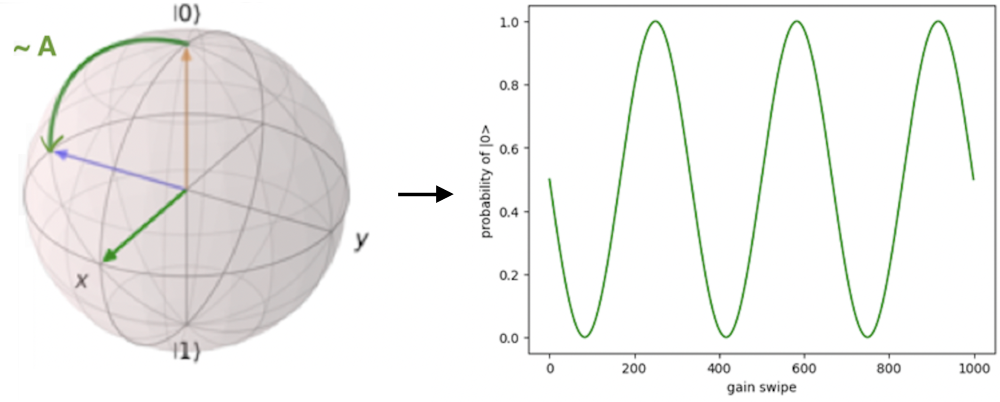
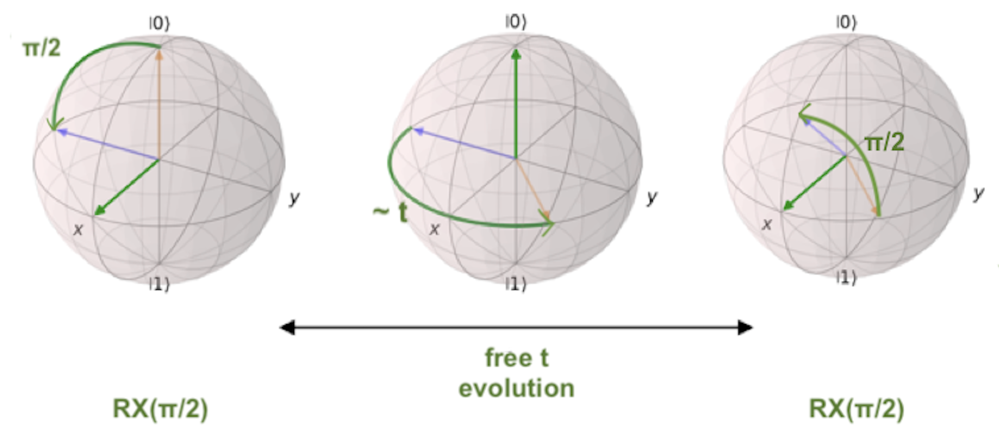

.. _platform:

Platform
=========

The platform represents the laboratory setup used to control the quantum devices.

The :class:`ql.Platform` object is the responsible for managing the initializations, connections, setups, and executions of the laboratory, which mainly consists of:

- Buses

- Instruments

Below you can find a beginner's tutorial on how to use the :class:`ql.Platform` class to execute quantum experiments on your hardware.

.. note::

    The following examples contain made up results. These will soon be updated with real results.

Building and printing a Platform:
----------------------------------

To build a platform, you need to use the :meth:`ql.build_platform()` function:

.. code-block:: python

    import qililab as ql

    platform = ql.build_platform(runcard="runcards/galadriel.yml")

where ``"runcards/galadriel.yml"`` is the path to a YAML file containing the :ref:`runcard <runcards>`, a dictionary of the serialized platform. This dictionary contains the information to connect, set up, and control the laboratory.

.. note::

    You can find more information about the actual structure of such dictionary, in the :ref:`Runcards <runcards>` section of the documentation.

You can verify if the platform has been built correctly, by printing the platform ``name``, and its ``chip`` and ``buses`` structures:

>>> print(platform.name)
galadriel

>>> print(platform.chip)
Chip with 2 qubits and 6 ports:
* Port drive_line_q0 (drive): ----|qubit_0|----
* Port drive_line_q1 (drive): ----|qubit_1|----
* Port flux_line_q0 (flux): ----|qubit_0|----
* Port flux_line_q1 (flux): ----|qubit_1|----
* Port feedline_input (feedline_input): ----|resonator_q0|--|resonator_q1|----
* Port feedline_output (feedline_output): ----|resonator_q0|--|resonator_q1|----

>>> print(platform.buses)
Bus feedline_bus:  -----|QRM1|--|rs_1|------|resonator_q0|------|resonator_q1|----
Bus drive_line_q0_bus:  -----|QCM-RF1|------|qubit_0|----
Bus flux_line_q0_bus:  -----|QCM1|------|qubit_0|----
Bus drive_line_q1_bus:  -----|QCM-RF1|------|qubit_1|----
Bus flux_line_q1_bus:  -----|QCM1|------|qubit_1|----

which displays the connections between the buses, instruments and elements of the chip.

|

Connecting and setting up the instruments with Platform:
---------------------------------------------------------

After building the platform, you need to connect to the instruments, set all the parameters defined in the runcard, and turn on the sources outputs using the following methods:

.. code-block:: python

    platform.connect()
    # Connects to all the instruments and blocks the connection for other users.
    # You must be connected to proceed with the following steps.

    platform.initial_setup()
    # Sets the values of the runcard (serialized platform) to the connected instruments.
    # You might want to skip this step if you think no parameters have been modified since last time, but we recommend doing it anyway.

    platform.turn_on_instruments()
    # Turns on the signal output for the generator instruments (RF, voltage sources and current sources).
    # This does not actually turn on the instruments of the laboratory, it only opens the signal output generation of the sources.
    # You might want to skip this step if the instruments outputs are already open, but again, we recommend doing it anyway.

.. note::

    To connect, your computer must be in the same network of the instruments specified in the runcard (with their IP's addresses).

|

Executing a circuit with Platform:
-----------------------------------
The Platform offers the capability to execute circuits defined with `Qibo <https://qibo.science/>`_, an open-source middleware for quantum computing.

To execute a circuit, you first need to build, connect, and set up the platform as shown in the above examples. Then, define your
Qibo circuit, for example, a pi pulse and a measurement gate on qubit ``q`` (``int``):

.. code-block:: python3

    from qibo.models import Circuit
    from qibo import gates

    circuit = Circuit(q+1)
    circuit.add(gates.X(q))
    circuit.add(gates.M(q))

And you are ready to execute the circuit with the platform:

>>> result = platform.execute(program=circuit, num_avg=1000, repetition_duration=6000)
>>> result.array
array([[5.],
        [5.]])

getting the integrated values of the I/Q signals received by the digitizer!

.. note::

    When disabling scope acquisition mode, the array obtained has shape `(#sequencers, 2, #bins)`. In this case,
    given that you are using only 1 sequencer to acquire the results, you would obtain an array with shape `(2, #bins)`.

You could also get the results in a more standard format, as already classified ``counts`` or ``probabilities`` dictionaries, with:

>>> result.counts
{'0': 501, '1': 499}

>>> result.probabilities
{'0': .501, '1': .499}

.. note::

    You can find more information about the results, in the :class:`.Results` class documentation.

|

Running a Rabi sweep with Platform:
---------------------------------------

To perform a Rabi sweep, build, connect and set up the platform, and then create a circuit with a
pi pulse and a measurement gate in qubit ``q`` (``int``), as in the previous examples, which all together look like:

.. code-block:: python

    import qililab as ql

    import numpy as np

    from qibo.models import Circuit
    from qibo import gates

    # Defining the Rabi circuit:
    circuit = Circuit(q+1)
    circuit.add(gates.X(q))
    circuit.add(gates.M(q))

    # Building the platform:
    platform = ql.build_platform(runcard="runcards/galadriel.yml")

    # Connecting and setting up the platform:
    platform.connect()
    platform.initial_setup()
    platform.turn_on_instruments()

Now to run the Rabi sweep, you would need to run this sequence by looping over the amplitude of the AWG used
to create the pi pulse:

To do this, you need to use the ``set_parameter()`` method with the alias of the bus used
to drive qubit ``q`` (let's assume it's called ``"drive_q"``):

.. code-block:: python3

    results = []
    amp_values = [0.0, 0.1, 0.2, 0.3, 0.4, 0.5, 0.6, 0.7, 0.9, 1.0]

    for amp in amp_values:
        platform.set_parameter(alias="drive_q", parameter=ql.Parameter.AMPLITUDE, value=amp)
        result = platform.execute(program=circuit, num_avg=1000, repetition_duration=6000)
        results.append(result.array)

And then you can use ``np.hstack`` to stack the obtained results horizontally. By doing this, you would obtain an
array with shape `(2, N)`, where N is the number of elements inside the loop:

>>> results = np.hstack(results)
>>> results
array([[5, 4, 3, 2, 1, 2, 3, 4, 5, 4, 3],
        [5, 4, 3, 2, 1, 2, 3, 4, 5, 4, 3]])

You can see how the integrated I/Q values oscillated, indicating that qubit 0 oscillates between ground and
excited state!

|

A faster Rabi sequence, translating the circuit to pulses:
-----------------------------------------------------------

Since you are looping over variables that are independent of the circuit (in this case, the amplitude of the AWG),
you can speed up the experiment by translating the circuit into pulses only once:

.. code-block:: python3

    from qililab.pulse.circuit_to_pulses import CircuitToPulses

    pulse_schedule = CircuitToPulses(platform=platform).translate(circuits=[circuit])

and then, executing the obtained pulses inside the loop, by passing the translated
``pulse_schedule`` instead than the ``circuit``, to the ``execute()`` method:

.. code-block:: python3

    results = []
    amp_values = [0.0, 0.1, 0.2, 0.3, 0.4, 0.5, 0.6, 0.7, 0.9, 1.0]

    for amp in amp_values:
        platform.set_parameter(alias="drive_q", parameter=ql.Parameter.AMPLITUDE, value=amp)
        result = platform.execute(program=pulse_schedule, num_avg=1000, repetition_duration=6000)
        results.append(result.array)

This approach yields to similar results, but much faster!

>>> results = np.hstack(results)
>>> results
array([[5, 4, 3, 2, 1, 2, 3, 4, 5, 4, 3],
        [5, 4, 3, 2, 1, 2, 3, 4, 5, 4, 3]])

|

Ramsey sequence, looping over a parameter inside the circuit:
----------------------------------------------------------------

To perform a Ramsey sequence, build, connect and setup the platform as before, but this time with a different circuit:

.. code-block:: python

    import qililab as ql

    from qibo.models import Circuit
    from qibo import gates

    # Defining the Ramsey circuit:
    circuit = Circuit(q + 1)
    circuit.add(gates.RX(q, theta=np.pi/2))
    circuit.add(ql.Wait(q, t=0))
    circuit.add(gates.RX(q, theta=np.pi/2))
    circuit.add(gates.M(q))

    # Building the platform:
    platform = ql.build_platform(runcard="runcards/galadriel.yml")

    # Connecting and setting up the platform:
    platform.connect()
    platform.initial_setup()
    platform.turn_on_instruments()

where you would add two default qibo ``RX`` gates, with a qililab ``Wait`` gate in between, which is just a personalized qibo gate that adds a
free evolution of duration ``t`` that corresponds to a rotation at the detuning frequency, around the Z axis:

To run the Ramsey sequence, you would need to loop over the ``t`` parameter of the ``Wait`` gate. This will produce a
different `Z` axis height projection for each wait time, resulting in a sinusoidal pattern.

Since the parameter is inside the Qibo circuit, you will need to use Qibo own ``circuit.set_parameters()`` method, putting the parameters
you want to set in the order they appear in the circuit construction:

.. note::
    For more information, please visit the Qibo documentation about `qibo.models.circuit.set_parameter() <https://qibo.science/qibo/stable/api-reference/qibo.html#gates:~:text=circuit%E2%80%99s%20gate%20queue.-,set_parameters,-(parameters)>`_ method.

.. code-block:: python3

    results = []
    wait_times = [0, 1, 2, 3, 4, 5, 6, 7, 8, 9, 10]

    for wait in wait_times:
        circuit.set_parameters([np.pi/2, wait, np.pi/2])
        result = platform.execute(program=circuit, num_avg=1000, repetition_duration=6000)
        results.append(result.array)

which for each execution, would set ``np.pi/2`` to the ``theta`` parameters of the ``RX`` gates, and the looped ``wait`` time  to the ``t`` parameter of the
``Wait`` gate.

And finally, if you print the results, you obtain the sinusoidal expected behaviour!

>>> results = np.hstack(results)
>>> results
array([[5, 4, 3, 2, 1, 2, 3, 4, 5, 4, 3],
        [5, 4, 3, 2, 1, 2, 3, 4, 5, 4, 3]])
