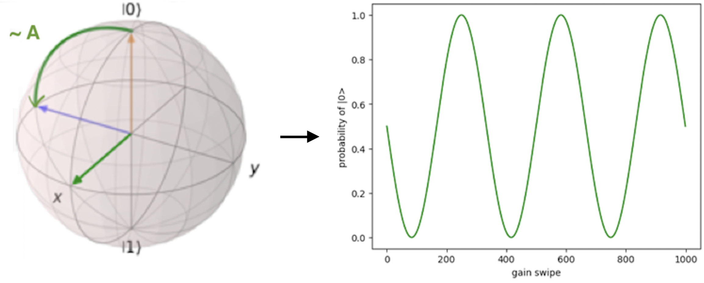
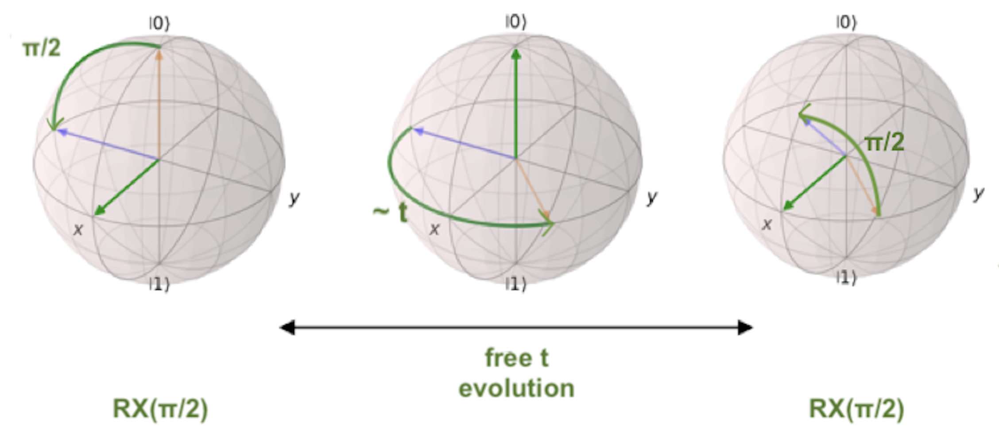

.. _platform:

Platform
=========

The platform represents the laboratory setup used to control the quantum devices.

The :class:`.Platform` object is the responsible for managing the initializations, connections, setups, and executions of the laboratory, which mainly consists of:

- Buses

- Instruments

Below you can find a beginner's tutorial on how to use the :class:`.Platform` class to execute quantum experiments on your hardware.

.. note::

    The following examples contain made up results. These will soon be updated with real results.

Building and printing a Platform:
----------------------------------

To build a platform, you need to use the :meth:`ql.build_platform()` function:

.. code-block:: python

    import qililab as ql

    platform = ql.build_platform(runcard="runcards/galadriel.yml")

where ``"runcards/galadriel.yml"`` is the path to a YAML file containing the :ref:`runcard <runcards>`, a dictionary of the serialized platform. This dictionary contains the information to connect, set up, and control the laboratory.

.. note::

    You can find more information about the actual structure of such dictionary, in the :ref:`Runcards <runcards>` section of the documentation.

You can verify if the platform has been built correctly, by printing the platform ``name`` and its ``buses`` structure:

>>> print(platform.name)
galadriel

>>> print(platform.buses)
Bus feedline_bus:  -----|QRM1|--|rs_1|------|resonator_q0|------|resonator_q1|----
Bus drive_line_q0_bus:  -----|QCM-RF1|------|qubit_0|----
Bus flux_line_q0_bus:  -----|QCM1|------|qubit_0|----
Bus drive_line_q1_bus:  -----|QCM-RF1|------|qubit_1|----
Bus flux_line_q1_bus:  -----|QCM1|------|qubit_1|----

which displays the connections between the buses and instruments.

|

Connecting and setting up the instruments with Platform:
---------------------------------------------------------

After building the platform, you need to connect to the instruments, set all the parameters defined in the runcard, and turn on the sources outputs using the following methods:

.. code-block:: python

    platform.connect()
    # Connects to all the instruments and blocks the connection for other users.
    # You must be connected to proceed with the following steps.

    platform.initial_setup()
    # Sets the values of the runcard (serialized platform) to the connected instruments.
    # You might want to skip this step if you think no parameters have been modified since last time, but we recommend doing it anyway.

    platform.turn_on_instruments()
    # Turns on the signal output for the generator instruments (RF, voltage sources and current sources).
    # This does not actually turn on the instruments of the laboratory, it only opens the signal output generation of the sources.
    # You might want to skip this step if the instruments outputs are already open, but again, we recommend doing it anyway.

.. note::

    To connect, your computer must be in the same network of the instruments specified in the runcard (with their IP's addresses).

|

Executing a QProgram with Platform:
-------------------------------------

The Platform executes hardware-agnostic pulse programs defined with :class:`.QProgram`, described in detail in the :ref:`QProgram <qprogram>` section of the documentation.

To execute a QProgram, you first need to build, connect, and set up the platform as shown in the above examples. Then, define your
QProgram, for example, a pi pulse on the drive bus of qubit ``0`` followed by a readout on its feedline bus:

.. code-block:: python3

    from qililab import QProgram
    from qililab.waveforms import IQDrag, Square, IQPair

    pi_pulse = IQDrag(amplitude=1.0, duration=100, num_sigmas=4.5, drag_coefficient=-2.0)
    readout_pulse = IQPair(I=Square(amplitude=1.0, duration=2000), Q=Square(amplitude=0.0, duration=2000))
    weights = IQPair(I=Square(amplitude=1.0, duration=2000), Q=Square(amplitude=0.0, duration=2000))

    qp = QProgram()
    qp.play(bus="drive_line_q0_bus", waveform=pi_pulse)
    qp.measure(bus="feedline_bus", waveform=readout_pulse, weights=weights)

And you are ready to execute it with the platform:

>>> result = platform.execute_qprogram(qprogram=qp)
>>> result.results["feedline_bus"][0].array
array([[5.],
        [5.]])

getting the integrated values of the I/Q signals received by the digitizer!

.. note::

    ``result.results`` maps each measured bus alias to the list of :class:`.MeasurementResult` produced on that bus, one per ``measure()``/``acquire()`` call, in the order they were issued.

.. note::

    You can find more information about the results, in the ``QProgramResults`` class documentation.

|

Running a Rabi sweep with Platform:
---------------------------------------

To perform a Rabi sweep, build, connect and set up the platform as before. Instead of looping in Python and re-executing a program for
each amplitude, sweep the drive gain directly inside the QProgram, so the whole sweep runs as a single, hardware loop:

.. code-block:: python3

    from qililab import QProgram, Domain
    from qililab.waveforms import IQDrag, Square, IQPair

    pi_pulse = IQDrag(amplitude=1.0, duration=100, num_sigmas=4.5, drag_coefficient=-2.0)
    readout_pulse = IQPair(I=Square(amplitude=1.0, duration=2000), Q=Square(amplitude=0.0, duration=2000))
    weights = IQPair(I=Square(amplitude=1.0, duration=2000), Q=Square(amplitude=0.0, duration=2000))

    qp = QProgram()
    gain = qp.variable(label="gain", domain=Domain.Voltage)
    with qp.for_loop(variable=gain, start=0.0, stop=1.0, step=0.1):
        qp.set_gain(bus="drive_line_q0_bus", gain=gain)
        qp.play(bus="drive_line_q0_bus", waveform=pi_pulse)
        qp.measure(bus="feedline_bus", waveform=readout_pulse, weights=weights)

    result = platform.execute_qprogram(qprogram=qp)

The single measurement now holds one value per point of the sweep, with shape `(2, #bins)`:

>>> result.results["feedline_bus"][0].array
array([[5, 4, 3, 2, 1, 2, 3, 4, 5, 4],
        [5, 4, 3, 2, 1, 2, 3, 4, 5, 4]])

You can see how the integrated I/Q values oscillate, indicating that qubit 0 oscillates between ground and
excited state!

|

Ramsey sequence, looping over a wait time:
----------------------------------------------

To perform a Ramsey sequence, build, connect and setup the platform as before, but this time define a QProgram with two half-pi pulses
separated by a variable delay:

To sweep the delay, declare a variable of ``Domain.Time`` and use it with the ``wait()`` method, in a hardware-timed loop just like the Rabi sweep above:

.. code-block:: python3

    from qililab import QProgram, Domain
    from qililab.waveforms import IQDrag, Square, IQPair

    half_pi_pulse = IQDrag(amplitude=0.5, duration=100, num_sigmas=4.5, drag_coefficient=-2.0)
    readout_pulse = IQPair(I=Square(amplitude=1.0, duration=2000), Q=Square(amplitude=0.0, duration=2000))
    weights = IQPair(I=Square(amplitude=1.0, duration=2000), Q=Square(amplitude=0.0, duration=2000))

    qp = QProgram()
    wait_time = qp.variable(label="wait_time", domain=Domain.Time)
    with qp.for_loop(variable=wait_time, start=0, stop=10000, step=1000):
        qp.play(bus="drive_line_q0_bus", waveform=half_pi_pulse)
        qp.wait(bus="drive_line_q0_bus", duration=wait_time)
        qp.play(bus="drive_line_q0_bus", waveform=half_pi_pulse)
        qp.measure(bus="feedline_bus", waveform=readout_pulse, weights=weights)

    result = platform.execute_qprogram(qprogram=qp)

Looping over ``wait_time`` produces a different `Z` axis height projection for each delay, resulting in a sinusoidal pattern:

>>> result.results["feedline_bus"][0].array
array([[5, 4, 3, 2, 1, 2, 3, 4, 5, 4, 3],
        [5, 4, 3, 2, 1, 2, 3, 4, 5, 4, 3]])
